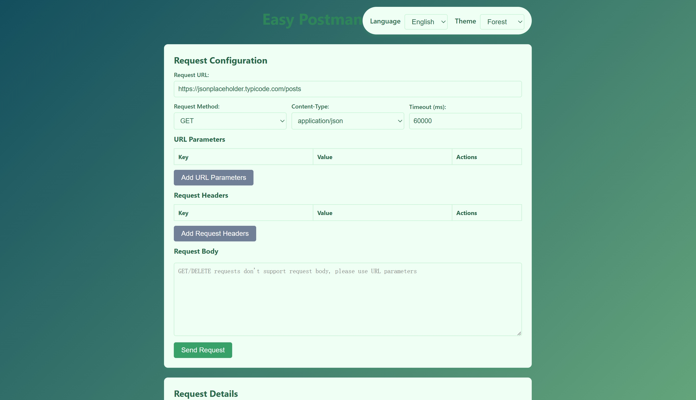
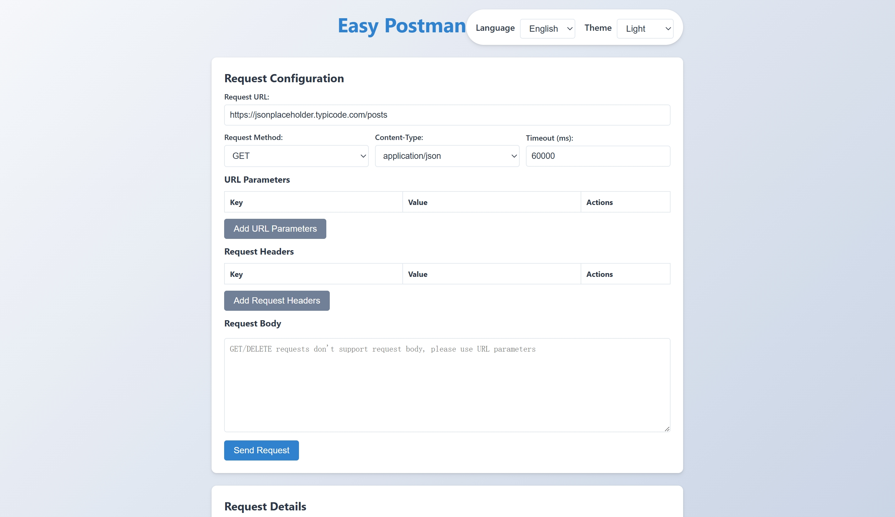
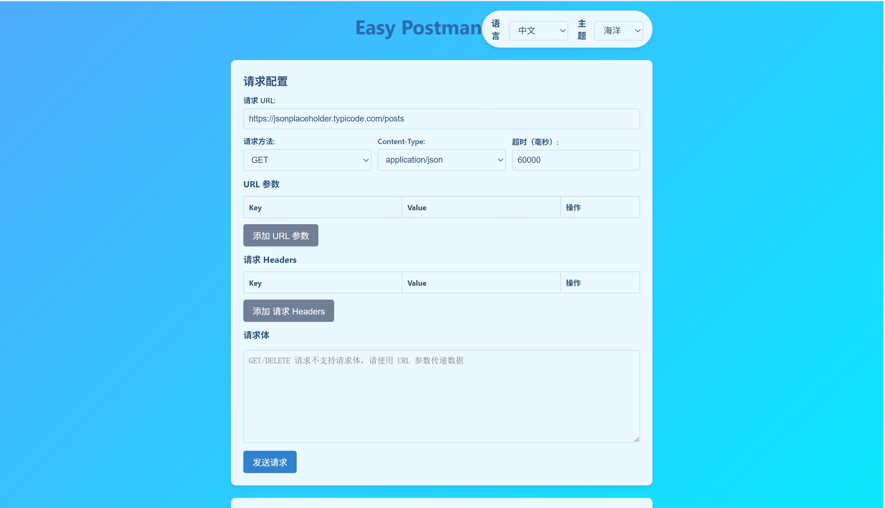

### Easy-Postman

#### Introduce / 介绍
An easy-to-use Postman Chrome extension tool for testing HTTP requests. It runs offline without any backend services or third-party dependencies, taking minimal space.

一个简单易用的 Chrome 浏览器插件 Postman 工具，可以用来测试 HTTP 接口，不依赖任何后台服务和第三方服务，可以在离线环境运行，占用空间极小。

#### Features / 功能特点

- **Offline Operation / 离线运行**: Works completely offline with no backend dependencies.
- **HTTP Request Testing / HTTP请求测试**: Supports GET, POST, PUT, DELETE, PATCH methods.
- **Parameter Management / 参数管理**: URL parameters, headers, and request body support.
- **Response Visualization / 响应可视化**: Formatted JSON viewing and raw response display.
- **Multilingual Support / 多语言支持**: English and Chinese interfaces.
- **Multiple Themes / 多主题支持**: 6 beautiful themes to choose from.

#### Screenshot / 截图

#### Installation / 安装方式

1. Download the extension files / 下载扩展文件
2. Open Chrome and navigate to `chrome://extensions/` / 打开Chrome并导航至`chrome://extensions/`
3. Enable Developer Mode / 启用开发者模式
4. Click "Load unpacked" and select the extension directory / 点击"加载已解压的扩展程序"并选择扩展目录

#### Usage / 使用方法

1. Click the Easy Postman icon in your Chrome toolbar / 点击Chrome工具栏中的Easy Postman图标
2. Enter your request details (URL, method, headers, etc.) / 输入请求详情（URL、方法、标头等）
3. Click "Send Request" to execute / 点击"发送请求"执行
4. View the formatted response / 查看格式化的响应

#### New in v1.1 / v1.1新增功能

- Added multilingual support (English/Chinese) / 新增多语言支持（英文/中文）
- Added 6 beautiful themes / 新增6种精美主题
- Improved UI with responsive design / 改进了响应式UI设计